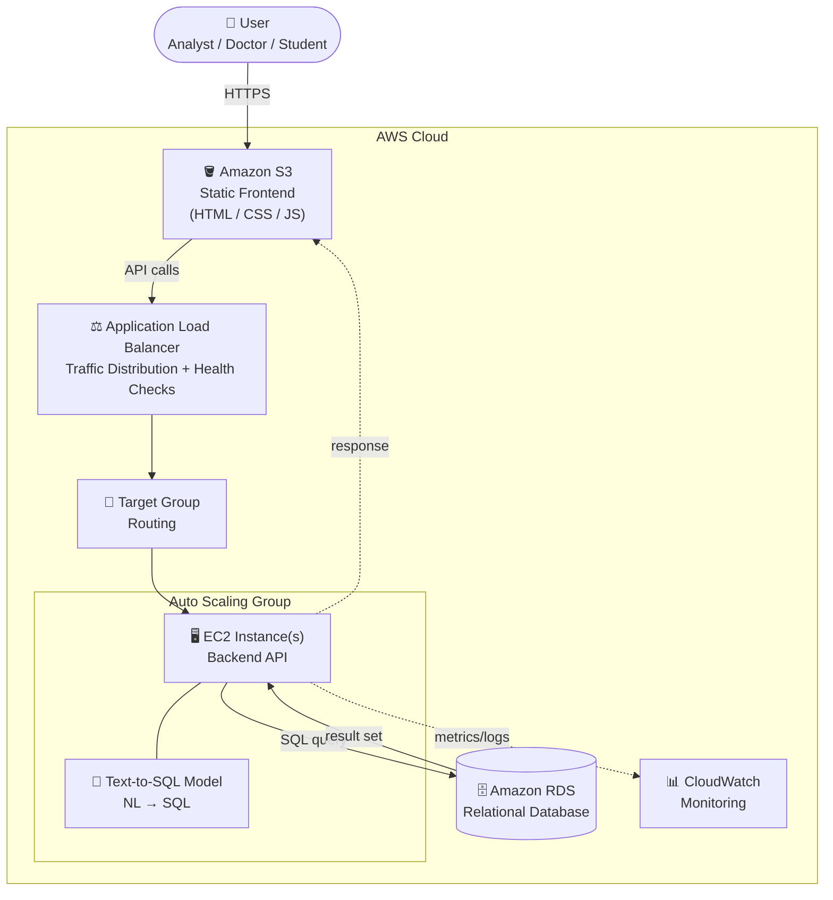

# ScalSQL

**Natural Language → SQL, deployed on AWS.**

ScalSQL is a multi-tenant web application that lets non-technical users (analysts, doctors, students) query relational databases in plain English. A fine-tuned **T5 text-to-SQL model** translates a natural-language question into a SQL query, the query is validated for safety, executed against the connected database, and the results are returned to the user.


---

## Table of Contents

- [Overview](#overview)
- [Architecture](#architecture)
- [Features](#features)
- [Tech Stack](#tech-stack)
- [Project Structure](#project-structure)
- [The Text-to-SQL Model](#the-text-to-sql-model)
- [Getting Started (Local)](#getting-started-local)
- [Environment Variables](#environment-variables)
- [API Reference](#api-reference)
- [Security](#security)
- [Deployment (AWS)](#deployment-aws)
- [Authors](#authors)

---

## Overview

Traditional database access requires knowing SQL. ScalSQL removes that barrier: an organization connects its database, and its users simply ask questions like *"How many users signed up last month?"* The system generates the corresponding SQL, runs it safely, and shows the answer as a table and chart.

The platform is **multi-tenant** — each organization has its own users, its own database connection, and isolated query history and analytics.

## Architecture

The application is deployed as a multi-tier, load-balanced, auto-scaling stack on AWS.



**Request flow:** User → S3 (frontend) → ALB → Target Group → EC2 (backend + model) → RDS, and the result set flows back the same way. Security Groups enforce network boundaries around each tier, an Auto Scaling Group keeps EC2 capacity elastic, and CloudWatch handles monitoring.

## Features

- 🗣️ **Natural-language querying** — ask questions in English, get SQL and results.
- 🏢 **Multi-tenant** — per-organization users, database connections, and history.
- 🔐 **Authentication** — JWT-based auth with hashed passwords (bcrypt).
- 🛡️ **Safe execution** — generated SQL is parsed and restricted to read-only `SELECT` queries before it ever touches the database.
- 🔗 **Bring your own database** — connect an external Postgres database; credentials are encrypted at rest.
- 📈 **Analytics & history** — dashboards, query logs, and usage analytics per organization.
- ⚙️ **Admin & settings** — organization administration and user settings panels.

## Tech Stack

| Layer | Technology |
|-------|-----------|
| **Frontend** | React 19, Vite, Tailwind CSS, React Router, Framer Motion, Recharts |
| **Backend** | Node.js, Express 5, Sequelize (ORM) |
| **Database** | PostgreSQL |
| **Auth** | JSON Web Tokens (`jsonwebtoken`), `bcryptjs` |
| **SQL safety** | `node-sql-parser` (AST-level validation) |
| **ML model** | T5 (`T5ForConditionalGeneration`) fine-tuned on the Spider dataset (PyTorch / Hugging Face Transformers) |
| **Cloud** | AWS — S3, EC2, RDS, Application Load Balancer, Auto Scaling, CloudWatch, Security Groups |

## Project Structure

```
Cloud Project/
├── scalsql-backend/          # Node.js + Express REST API
│   └── src/
│       ├── app.js            # Express app + route mounting
│       ├── index.js          # Server entrypoint
│       ├── config/           # Database (Sequelize) configuration
│       ├── controllers/      # auth, config, query, analytics, admin, settings
│       ├── models/           # User, Organization, DBConnection, QueryLog
│       ├── routes/           # API route definitions
│       ├── middlewares/      # JWT auth middleware
│       ├── services/         # Model-serving integration
│       └── utils/            # SQL validator, credential encryption
│
├── scalsql-frontend/         # React + Vite single-page app
│   └── src/
│       ├── pages/            # Landing, Login, Register, Dashboard, QueryGenerator,
│       │                     #   QueryResults, QueryHistory, DatabaseConfig,
│       │                     #   Analytics, AdminPanel, Settings
│       ├── components/       # UI components
│       └── lib/api.js        # API client (fetch wrapper + auth header)
│
└── t5_spider_ckpt/           # Fine-tuned T5 text-to-SQL model checkpoints
```

> The Python virtual environment (`t5_env/`) and `node_modules/` are intentionally not tracked in git.

## The Text-to-SQL Model

The core ML component is a **T5 sequence-to-sequence model** fine-tuned on [**Spider**](https://yale-lily.github.io/spider), a large-scale, cross-domain text-to-SQL benchmark. Given a natural-language question (and database schema), the model generates the corresponding SQL query. Trained checkpoints live in [`t5_spider_ckpt/`](t5_spider_ckpt/).

In the AWS deployment, the model runs on the EC2 backend tier. The repository also includes a service abstraction ([`services/sagemakerService.js`](scalsql-backend/src/services/sagemakerService.js)) so model inference can be swapped for a hosted endpoint without changing the API layer.

## Getting Started (Local)

### Prerequisites

- Node.js 18+
- PostgreSQL
- Python 3.10+ (only if you want to run the T5 model locally)

### 1. Backend

```bash
cd scalsql-backend
npm install
# create a .env file (see Environment Variables below)
npm run dev        # starts the API on http://localhost:5001
```

### 2. Frontend

```bash
cd scalsql-frontend
npm install
npm run dev        # starts Vite on http://localhost:5173
```

The frontend talks to the backend at `http://localhost:5001` (configurable in [`src/lib/api.js`](scalsql-frontend/src/lib/api.js)).

## Environment Variables

Create `scalsql-backend/.env`:

```env
PORT=5001

# Core database (Sequelize / Postgres)
DB_HOST=localhost
DB_NAME=scalsql_core
DB_USER=postgres
DB_PASSWORD=your_password

# Auth
JWT_SECRET=replace_with_a_long_random_string

# Credential encryption (must be exactly 32 characters for AES-256)
ENCRYPTION_KEY=your_32_character_encryption_key_
```

> `.env` is gitignored — never commit real secrets.

## API Reference

All routes are mounted under `/api`. Health check: `GET /health`.

| Prefix | Purpose |
|--------|---------|
| `/api/auth` | Register, login, JWT issuance |
| `/api/config` | Manage the organization's database connection |
| `/api/query` | Generate SQL from natural language + execute it |
| `/api/analytics` | Usage analytics / dashboards |
| `/api/admin` | Organization administration |
| `/api/settings` | User & org settings |

Protected routes require an `Authorization: Bearer <token>` header.

## Security

- **Read-only by design** — every generated statement is parsed with `node-sql-parser`; anything other than a `SELECT` (e.g. `DROP`, `DELETE`, `UPDATE`) is rejected before execution. See [`sqlValidator.js`](scalsql-backend/src/utils/sqlValidator.js).
- **Encrypted credentials** — connected-database credentials are encrypted at rest using AES-256-CBC. See [`encryption.js`](scalsql-backend/src/utils/encryption.js).
- **Hashed passwords** — user passwords are hashed with bcrypt.
- **Token auth** — stateless JWT authentication guards protected endpoints.
- **Network isolation** — in AWS, Security Groups scope traffic between the load balancer, compute, and database tiers.

## Deployment (AWS)

| Service | Role |
|---------|------|
| **Amazon S3** | Hosts the static frontend build |
| **Application Load Balancer** | Distributes traffic, health checks |
| **Target Group** | Routes ALB traffic to healthy EC2 instances |
| **Amazon EC2** | Runs the backend API and the text-to-SQL model |
| **Auto Scaling Group** | Scales EC2 capacity with demand |
| **Amazon RDS** | Managed relational database |
| **CloudWatch** | Metrics, logs, and monitoring |
| **Security Groups** | Firewall boundaries between tiers |

Build the frontend with `npm run build` and upload `dist/` to the S3 bucket; run the backend on EC2 behind the load balancer.

## Authors

- Ansari Usaid — [@AnsariUsaid](https://github.com/AnsariUsaid)

---

*Built as a cloud computing project demonstrating a full-stack, cloud-deployed ML application.*
